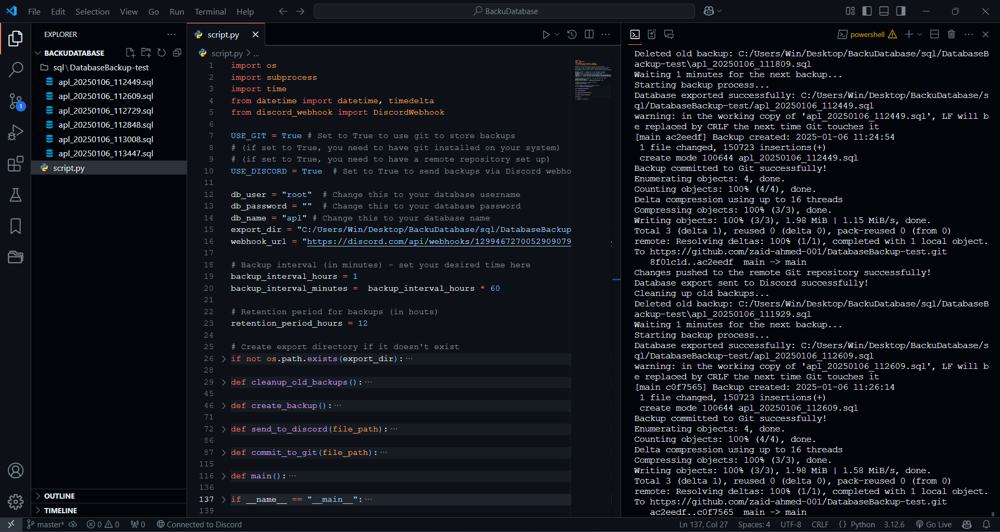
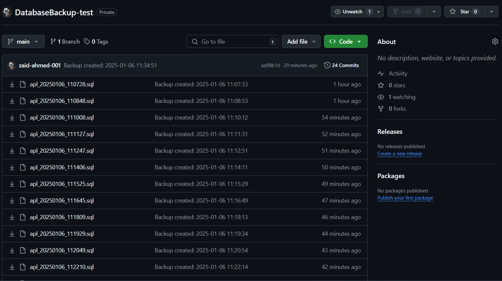

# Database Backup Automation Script (MySQL/MariaDB)

## Description
This Python script automates the backup process for MySQL and MariaDB databases. It creates backups of the specified database at regular intervals, stores them locally, and optionally uploads them to GitHub and Discord. It helps ensure that you have an up-to-date backup of your database and can easily restore or share it.

## Features
- **Database Backup:** Performs regular backups using `mysqldump` for both MySQL and MariaDB.
- **Git Integration:** Optionally commits the backup files to a Git repository and pushes to a remote repository.
- **Discord Integration:** Optionally uploads the backup files to a Discord channel via a webhook.
- **Backup Retention:** Deletes backups older than a specified retention period to avoid accumulating unnecessary files.
- **Flexible Backup Interval:** Allows you to define the interval at which backups are created.

## Prerequisites
Before using this script, ensure you have the following:
- **Python 3.x** installed.
- **MySQL** or **MariaDB** installed and properly configured for `mysqldump`.
- **Git** installed if you're using the Git integration.
- **Discord Webhook URL** if you're using the Discord integration.

## Installation

1. Clone this repository to your local machine:
   ```bash
   git clone https://github.com/your-username/repository-name.git

2. Install required Python libraries:
   ```bash
   pip install discord-webhook

3. Update the script with your own values:
   - Set the correct **database username** (`db_user`), **password** (`db_password`), and **database name** (`db_name`).
   - Update the **export directory** (`export_dir`) where the backups will be stored.
   - Configure the **Discord webhook URL** (`webhook_url`) if you're using Discord integration.

4. Run the script:
   ```bash
   python backup_script.py

## Configuration Options

- **USE_GIT**: Set to `True` to enable Git integration. The script will commit and push the backups to a Git repository.
- **USE_DISCORD**: Set to `True` to enable Discord integration. The script will send the backup files to the specified Discord channel via a webhook.
- **backup_interval_hours**: Set the backup interval in hours.
- **retention_period_hours**: Define how long backups should be kept before they are deleted.

## Example of Output
   ```bash
      Starting backup process...
      Database exported successfully: /path/to/backup/fubuki_20250106_123456.sql
      Backup committed to Git successfully!
      Changes pushed to the remote Git repository successfully!
      Database export sent to Discord successfully!
      Cleaning up old backups...
      Waiting 60 minutes for the next backup...
  ```

## Backup Directory Structure

The backup files will be stored in the directory specified by `export_dir`. Each backup will have a timestamp in its filename, such as `fubuki_20250106_123456.sql`.

## Cleanup

Backups older than the specified retention period (`retention_period_hours`) will be deleted automatically to maintain only recent backups.

## License

This project is licensed under the MIT License - see the [LICENSE](LICENSE) file for details.




